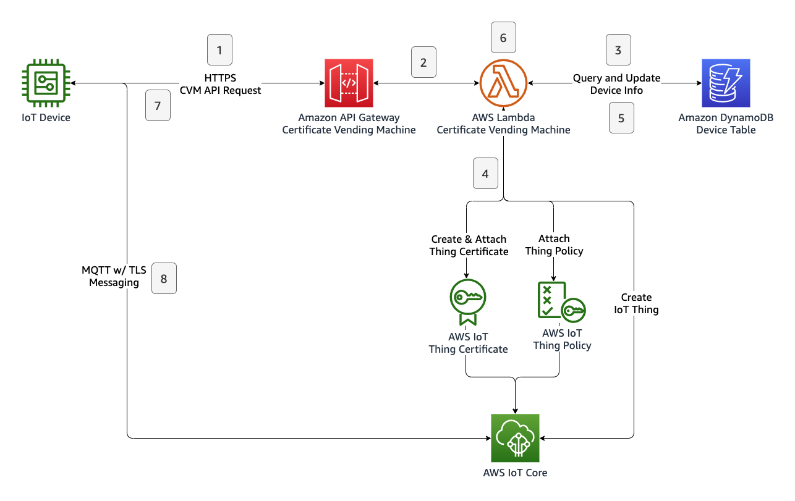

# aws-iot-device-bootstrap-certificate-vending-machine
Certificate Vending Machine is a device registration pattern applied when devices don’t have unique certificates during manufacturing and share the same firmware. Using a Certificate Vending Machine API endpoint (CVM, in short) devices are registered by logic on the cloud with the device’s claim of a unique identifier and a calculated hash with it. This unique identifier can be any serial number, MAC address, or IMEI. This exposed public API points to a cloud application that validates the incoming request and performs required operations to generate and attach certificates to the device.

# Use-Cases
Certificate Vending Machine approach for device registration can be a preferred method under the following conditions:

- Devices don’t have unique certificates during manufacturing and share the same firmware.
- Devices can state a unique identifier such as serial number, product ID, IMEI, or Mac ID.
- The manufacturing supply chain is not trusted or 3rd party stakeholders are involved in the device’s life cycle.
- Fine-grained validations or 3rd party service calls are needed to be run during the registration.
- The IoT device needs to interact with an authenticated secure API endpoint to perform its registration.

# Reference Architecture
The architecture of the CVM system is as follows:

The following steps are involved during registration of an IoT thing with certificate vending machine method:

1. Device sends a registration request with a payload containing the device’s unique identifier and registration token to the Amazon API Gateway endpoint.
2. Amazon API Gateway service checks the request and invokes the CVM Lambda function.
3. CVM Lambda function verifies the registration request by querying the Amazon DynamoDB table.
4. CVM Lambda function applies the registration process by creating an IoT thing certificate, attaching the predefined IoT policy to the certificate, creating an IoT thing, and attaching the certificate to the IoT thing.
5. CVM Lambda function updates device state info in the corresponding DynamoDB record.
6. CVM Lambda function prepares a JSON response payload that includes both unique certificates and AWS IoT Core endpoint information.
7. Device receives the certificates and IoT Core endpoint information. Completing the registration process.
8. Device initiates a new MQTT w/ TLS connection with its own certificates and parameters gathered from the CVM API response.

The basic representation of this flow is shown as follows:

# Authentication

Devices will use the public API endpoint to trigger their registration process. This request will contain the device’s unique identifier and registration token. The unique identifier will be used to build the thing’s name. The registration token is a calculated hash value to be stored in the DynamoDB table. The token will be calculated by the device using the same hashing algorithm during the preparation of the CVM API request. When the CVM Lambda receives a registration request, it validates the registration token provided by the device by comparing it with the one calculated previously and stored in the DynamoDB table. Since all devices share the same firmware, this token can be calculated by a combination of a “salt” and the device’s unique identifier. This salt is a secret string that makes SHA256() less predictable by making the input string longer. This secret salt string will be placed into your firmware. Since the salt string is a sensitive piece of data for device bootstrapping, the solution must consider the security of how the salt string is stored. 

We can summarise the process as follows:

1. Device manufacturer inserts a record to the DynamoDB table as: device_uid=DEVICE001, device_token=SHA256("YOUR_SECRET_SALT//DEVICE001") You can calculate this SHA256 hash with your favorite programming language or using online SHA256 calculators.
2. Device manufacturer places the salt string into the firmware for hashing.
3. During runtime, firmware combines the salt string and the device’s unique identifier to calculate the hash.
4. Then, the device sends a request with its unique identifier and calculated registration token to initiate the registration process.
5. Device will receive an HTTP response to the request. The response contains the thing name which will be used as client ID, certificates, and AWS IoT Core MQTT endpoint. Device should save this information in a non-volatile location.

# How to setup Certificate Vending Machine

# Reference
[https://iotatlas.net/en/implementations/aws/device_bootstrap/aws-iot-certificate-vending-machine/](https://iotatlas.net/en/implementations/aws/device_bootstrap/aws-iot-certificate-vending-machine/)